# Data Mining project (Save The Birds!)

Our group is developing a project to determine if there is a detectable pattern to the change of bird species composition each year for every season that is being reflected by the local bird-strike occurrence.

By gathering data from the Federal Aviation Administration's Bird Strike database, our groups goal is to break the data up by seasons concatented by the year in which they occur (same goes for the months within the season). In doing so, we aim to perform linear and sinusoidal regression techniques to determine which of the two techniques will output a better predictor in determing which season, along with the month, will have an increase in bird strikes. Our groups mission is to someday help our fellow citizens and birds alike fly beside each other, enjoying the beautiful scenery from above, in peace.

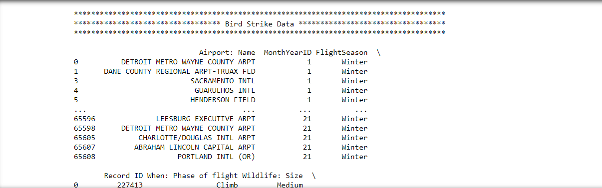

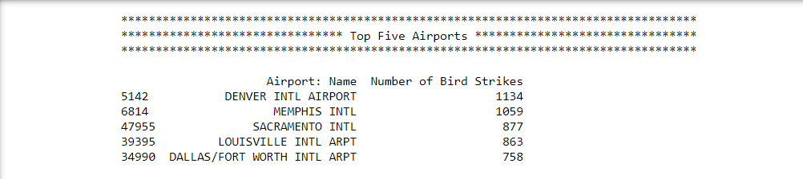

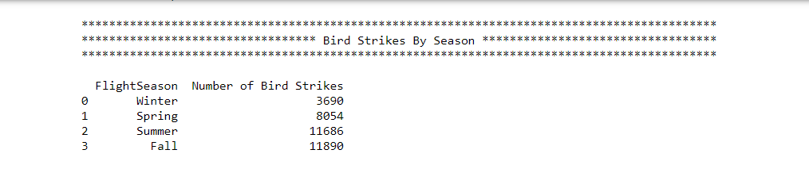

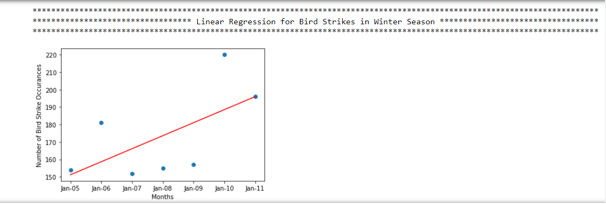

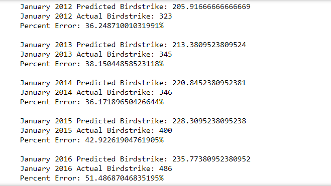

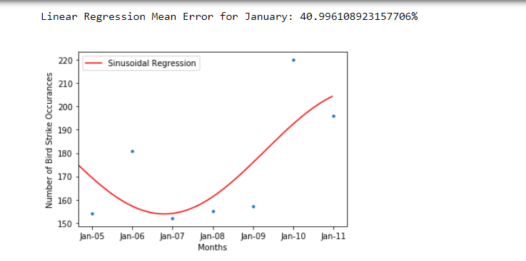

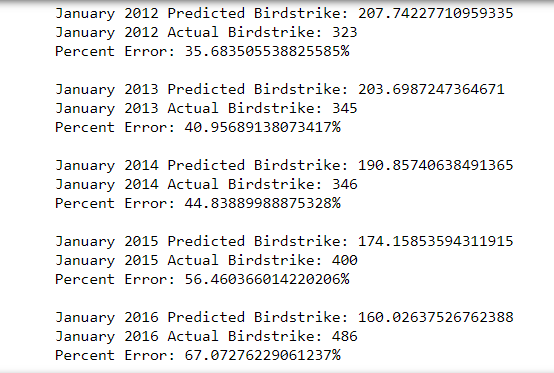

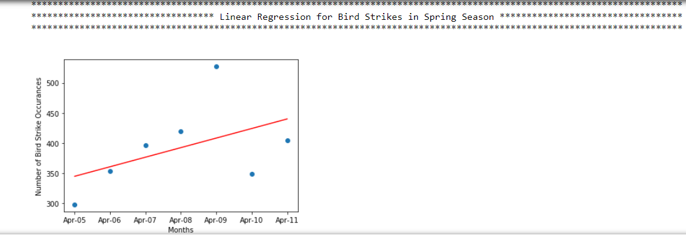

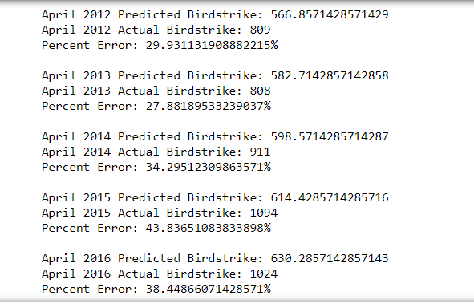

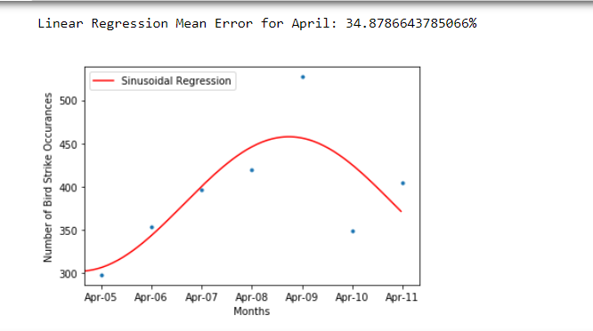

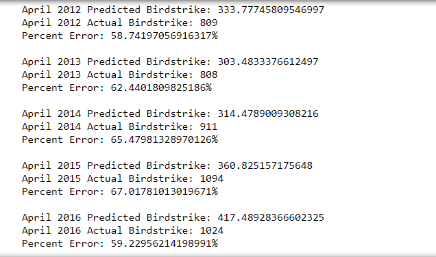

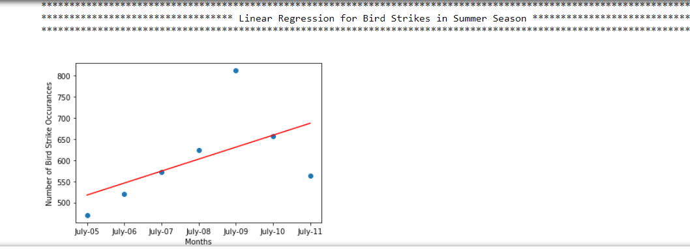

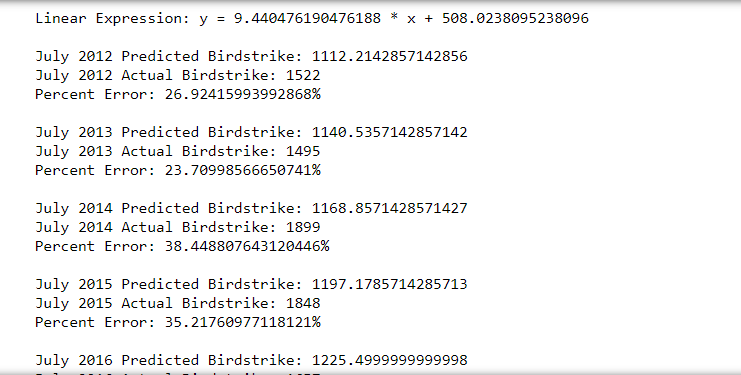

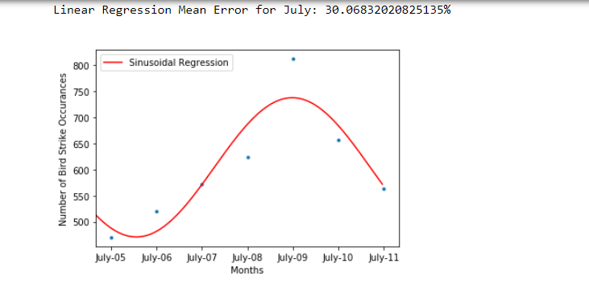

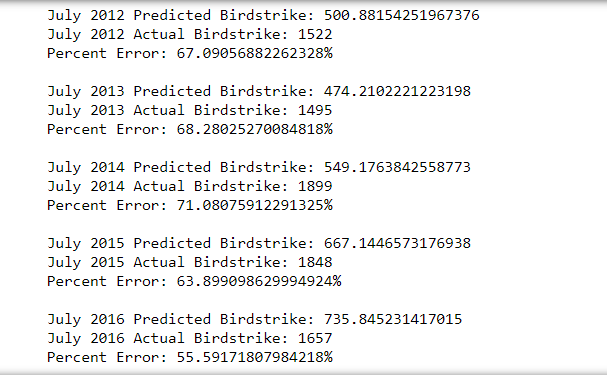

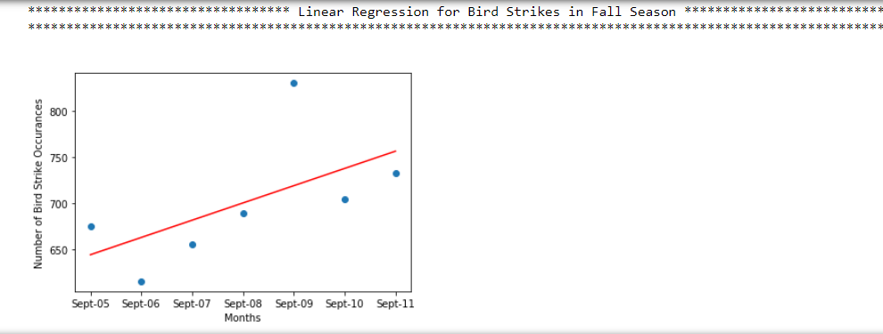

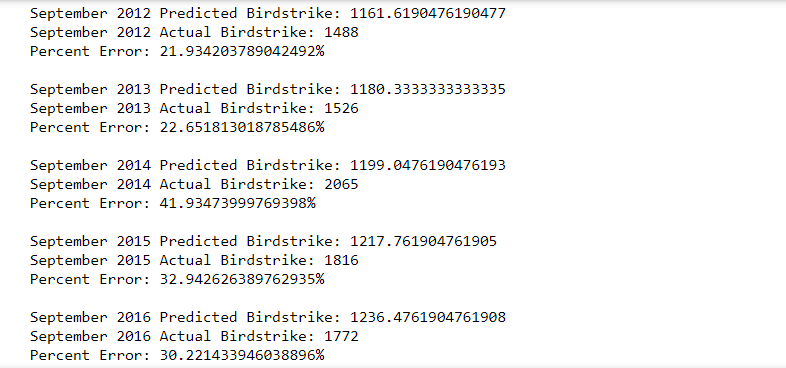

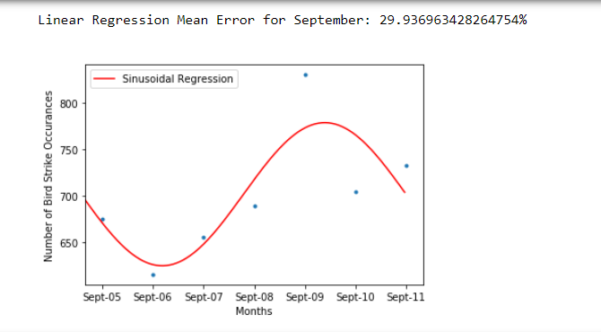

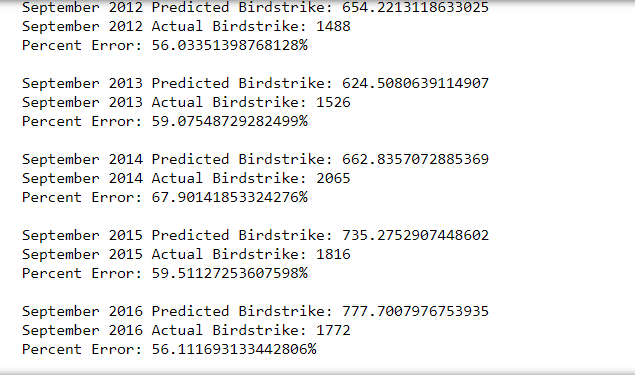